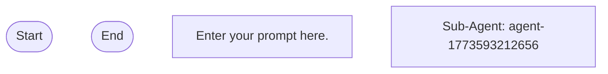

# prompt-agent-template

## Workflow Diagram



## Execution Instructions

## Workflow Execution Guide

Follow the Mermaid flowchart above to execute the workflow. Each node type has specific execution methods as described below.

### Execution Methods by Node Type

- **Rectangle nodes (Sub-Agent: ...)**: Execute Sub-Agents using the spawn_agent tool
- **Diamond nodes (AskUserQuestion:...)**: Use the ask_user_question tool to prompt the user and branch based on their response
- **Diamond nodes (Branch/Switch:...)**: Automatically branch based on the results of previous processing (see details section)
- **Rectangle nodes (Prompt nodes)**: Execute the prompts described in the details section below

## Sub-Agent Node Details

#### agent_1773593212656(Sub-Agent: agent-1773593212656)

**Description**: New Sub-Agent

**Model**: sonnet

**Prompt**:

```
Enter your prompt here
```

### Prompt Node Details

#### prompt_1773593180829(Enter your prompt here.)

```
Enter your prompt here.

You can use variables like {{variableName}}.
```
