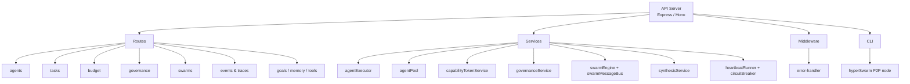

# Pixel-Agent

**Autonomous agent swarm platform with governance, budgeting, and observability**

[](https://github.com/RemyLoveLogicAI/Pixel-Agent/actions/workflows/ci.yml)
[](./LICENSE)
[](https://nodejs.org)

Pixel-Agent is a full-stack autonomous agent swarm platform that provides the infrastructure for running, coordinating, and governing fleets of AI agents. It handles the full agent lifecycle — from spawning and task assignment to budget enforcement and real-time observability — so you can focus on agent logic rather than plumbing.

---

## Features

- **Agent lifecycle management** — spawn, monitor, and terminate agents via a clean REST API; backed by an agent pool with circuit-breaker fault tolerance
- **Budget and governance engine** — capability tokens enforce spending limits and access controls; the governance service audits all agent actions
- **Task orchestration and swarm coordination** — the swarm engine assigns tasks to agent pools, routes messages via `swarmMessageBus`, and synthesises results through `synthesisService`
- **Real-time observability** — event traces capture every agent action; `/events` and `/traces` endpoints stream structured logs for dashboards or alerting
- **HyperSwarm P2P networking** — the CLI spins up a HyperSwarm node so distributed agent clusters can discover and communicate peer-to-peer

---

## Architecture



---

## Tech Stack

| Layer | Technology |
|---|---|
| Runtime | [Bun](https://bun.sh) |
| API framework | Express 5 / Hono |
| P2P networking | [HyperSwarm](https://github.com/hyperswarm/hyperswarm) |
| ORM | [Drizzle ORM](https://orm.drizzle.team) |
| Language | TypeScript 5 |
| Monorepo | pnpm workspaces |
| Linting/Formatting | [Biome](https://biomejs.dev) |

---

## Quickstart

### Prerequisites

- [pnpm](https://pnpm.io) ≥ 9
- Node.js ≥ 20 (or Bun ≥ 1.1)

### 1. Clone and install

```bash
git clone https://github.com/RemyLoveLogicAI/Pixel-Agent.git
cd Pixel-Agent
pnpm install
```

### 2. Configure environment

```bash
cp .env.example .env
# Edit .env with your DATABASE_URL and other required values
```

### 3. Start the API server

```bash
pnpm --filter @workspace/api-server run dev
```

### 4. (Optional) Start a HyperSwarm P2P node

```bash
pnpm run hyper-swarm
```

---

## Environment Variables

See [`.env.example`](./.env.example) for the full list. Key variables:

| Variable | Description | Default |
|---|---|---|
| `NODE_ENV` | Runtime environment | `development` |
| `PORT` | HTTP server port | `3000` |
| `DATABASE_URL` | Postgres or SQLite connection string | — |
| `CLOUDFLARE_ACCOUNT_ID` | Cloudflare account (optional, for Workers deploy) | — |
| `CLOUDFLARE_API_TOKEN` | Cloudflare API token with Workers:Edit permission | — |
| `LOG_LEVEL` | Pino log level (`trace`\|`debug`\|`info`\|`warn`\|`error`) | `info` |

---

## Docker

```bash
docker build -t pixel-agent .
docker run -p 3000:3000 --env-file .env pixel-agent
```

---

## Project Structure

```
Pixel-Agent/
├── artifacts/
│   ├── api-server/          # Core API — routes, services, middleware, CLI
│   └── mockup-sandbox/      # UI mockup / sandbox environment
├── lib/                     # Shared libraries (db, zod schemas, integrations)
├── scripts/                 # Build and utility scripts
├── .github/workflows/       # GitHub Actions CI
├── biome.json               # Linting and formatting config
├── Dockerfile               # Multi-stage Docker build
├── pnpm-workspace.yaml      # Monorepo workspace definition
└── tsconfig.base.json       # Shared TypeScript config
```

---

## Contributing

1. Fork the repo and create a feature branch: `git checkout -b feat/your-feature`
2. Make your changes and run `pnpm run typecheck` to verify types
3. Open a pull request against `develop`

Please follow the existing code style — Biome enforces formatting on CI.

---

## Security

See [SECURITY.md](./SECURITY.md) for our vulnerability disclosure policy. To report a security issue, email **security@lovelogicai.com** — do not open a public issue.

---

## License

[MIT](./LICENSE) © 2026 LoveLogicAI LLC

---

_Part of the [LoveLogicAI Agent Company OS](https://github.com/RemyLoveLogicAI)_
