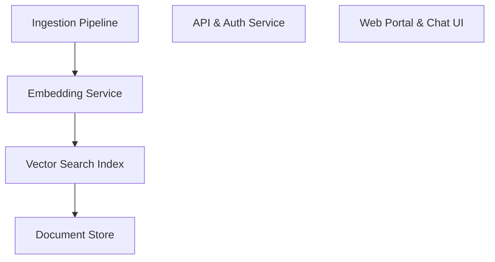

# 📚 Pixel-Agent Documentation

Welcome to the complete documentation for this repository. This documentation is automatically generated and maintained by Woden Docbot.

   

## 🔗 Quick Links

[📂 artifacts](./artifacts/README.md)
[📋 Dependencies](./DEPENDENCIES.md)

---

> An AI-assisted documentation platform that ingests, indexes, and serves organizational knowledge to developers and support teams via conversational and search interfaces.

## 📖 Overview

DocBot is an integrated documentation and knowledge platform designed to centralize, process, and surface organizational content for fast, accurate developer and support workflows. It automates ingestion from common sources (Markdown repositories, Confluence, PDFs), normalizes and enriches content with metadata and semantic embeddings, and stores both raw and processed artifacts for retrieval. The platform exposes both a conversational assistant for natural language Q&A and a faceted search interface for targeted discovery.

Architecturally, DocBot emphasizes modularity and observability. Content ingestion pipelines run asynchronously to extract, preprocess, and embed documents. A document store holds canonical artifacts while a vector index supports semantic search. API and web portal layers provide secure access and developer tooling. The design focuses on minimizing latency for interactive queries, ensuring data freshness through incremental ingestion, and providing role-based access control to protect sensitive information.

### 🧩 Key Components

| Component | Purpose | Technologies |
| --- | --- | --- |
| **Ingestion Pipeline** | Collects documents from repositories, cloud storage, and uploads; normalizes formats, extracts text and metadata, and partitions content for embedding. | `Python`, `Airflow`, `Azure Blob Storage` |
| **Embedding Service** | Generates and stores semantic embeddings for document chunks to enable vector similarity search and semantic retrieval. | `OpenAI/embedding models`, `Python`, `FastAPI` |
| **Vector Search Index** | Stores embeddings and executes nearest-neighbor queries for semantic retrieval used by the assistant and search UI. | `Milvus`, `Faiss`, `Weaviate` |
| **Document Store** | Holds source documents and processed fragments with metadata, versioning, and access control. | `PostgreSQL`, `Azure Blob Storage` |
| **API & Auth Service** | Exposes REST/GraphQL endpoints for search, QA, and admin operations; enforces authentication and RBAC. | `FastAPI`, `OAuth2`, `JWT` |
| **Web Portal & Chat UI** | User-facing interfaces for conversational access, guided search, and documentation browsing with feedback and annotation features. | `React`, `TypeScript`, `Tailwind CSS` |

**Component Architecture:**

### 🏗️ Architecture

Modular, cloud-native architecture combining asynchronous ingestion pipelines, a document store with a vector index for semantic search, and API/web frontends. Services are containerized and can run serverless or in Kubernetes with separate components for ingestion, embedding, search, and UI.

### 💡 Use Cases

- ✦ Developer onboarding and ad-hoc Q&A over internal docs and API references.
- ✦ Support agent assistant to surface troubleshooting steps and runbooks during customer incidents.
- ✦ Knowledge base search with semantic ranking for improved discovery across unstructured content.

### 🔧 Technologies

**Languages:** 

**Frameworks:**  

**Databases:** 
   

### 📦 External Dependencies

The following external packages are used across the project:

- `Azure Blob Storage`
- `Milvus`
- `OAuth provider (e.g., Azure AD)`
- `OpenAI API`
- `PostgreSQL`
- `Tika`

---

## 📑 Documentation Sections

### [artifacts](./artifacts/README.md)
Central storage for build and source artifacts related to documented components, serving as the artifact documentation index for the repository.

This directory holds documented artifacts and artifact-related documentation for components produced by the repository.

---

## 📊 Documentation Statistics

- **Files Documented**: 1
- **Directories**: 4
- **Coverage**: 100%
- **Last Updated**: 2026-03-15

---

## 🧭 How to Navigate

> ℹ️ **INFO**
> Each directory has its own README.md with detailed information about that section. Use the breadcrumb navigation at the top of each page to navigate back to parent directories.

### Navigation Features

- **Breadcrumbs** - At the top of each page, showing your current location
- **Directory READMEs** - Each folder has a comprehensive overview
- **File Documentation** - Click through to individual file documentation
- **Search** - Use GitHub's search or your IDE's search functionality

---

## 🤖 About Woden DocBot

This documentation is automatically generated and kept up-to-date by Woden DocBot, an AI-powered documentation assistant. DocBot analyzes code on every pull request and updates documentation to reflect changes.

### Features

- **Automatic Updates** - Documentation updates on every PR
- **Comprehensive Coverage** - Files, functions, classes, and directories
- **Smart Navigation** - Breadcrumbs, related files, and parent links
- **AI-Powered** - Uses Azure GPT models for intelligent documentation generation

---

*Generated by Woden DocBot for Pixel-Agent*