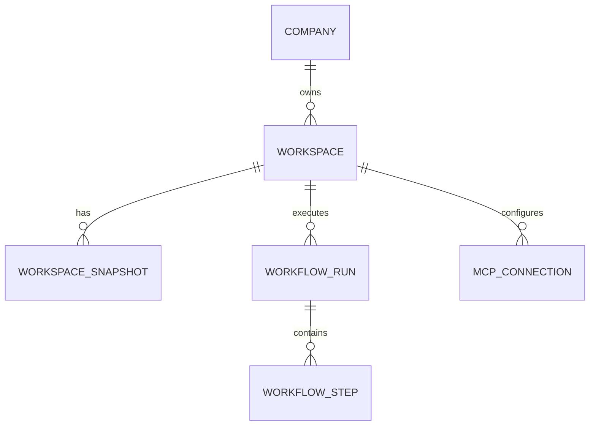

# AgentOS Computer Workspace — Minimal Data Model Additions

Pixel-Agent already has strong primitives for “agent runs” (`swarm_runs`, `heartbeat_runs`), approvals (`governance_requests`), memory (`memory_entries`), and tool tracing (`tool_calls`).

To support a **personal workspace runtime** and **snapshots**, add a minimal set of new entities.

## Proposed entities (conceptual ERD)

## Tables (minimal fields)

### `workspaces`

- `id` (uuid)
- `companyId` (fk → companies)
- `name`
- `runtimeType` (enum: `local_dir`, `container`, `vm`) — start with `local_dir`/`container`
- `fsRoot` (string path or volume handle)
- `status` (active/paused/archived)
- `createdAt`, `updatedAt`

### `workspace_snapshots`

- `id`
- `workspaceId` (fk)
- `label`
- `storageRef` (e.g., object storage key or local path)
- `createdBy` (agentId or “human”)
- `createdAt`

### `workflow_runs` (durable-ish execution journal)

Use this to make orchestration resumable before adopting Temporal.

- `id`
- `workspaceId`
- `kind` (enum: `skill_run`, `swarm_run_bridge`, `heartbeat_bridge`)
- `status` (running/paused/completed/failed/cancelled)
- `input` (json)
- `output` (json)
- `traceId`
- `createdAt`, `completedAt`

### `workflow_steps`

- `id`
- `workflowRunId`
- `idx` (int)
- `name`
- `status` (pending/running/blocked/completed/failed)
- `requiresApproval` (bool)
- `governanceRequestId` (nullable fk)
- `input` (json)
- `output` (json)
- `startedAt`, `completedAt`

### `mcp_connections`

Workspace-scoped connector configuration (token references live in secrets).

- `id`
- `workspaceId`
- `name` (e.g. `gmail`, `google-calendar`, `github`)
- `serverUrl` (for remote MCP) or `localCommand` (for local MCP server)
- `scopes` (json array)
- `status` (active/error)
- `createdAt`, `updatedAt`

## Notes

- This model avoids forcing a “User” table; Pixel-Agent currently centers on `companies`. You can layer user identity later in the API layer.
- `tool_calls` already has `companyId` and agent/run correlation fields; it can be extended with `workspaceId` once workspaces exist.

