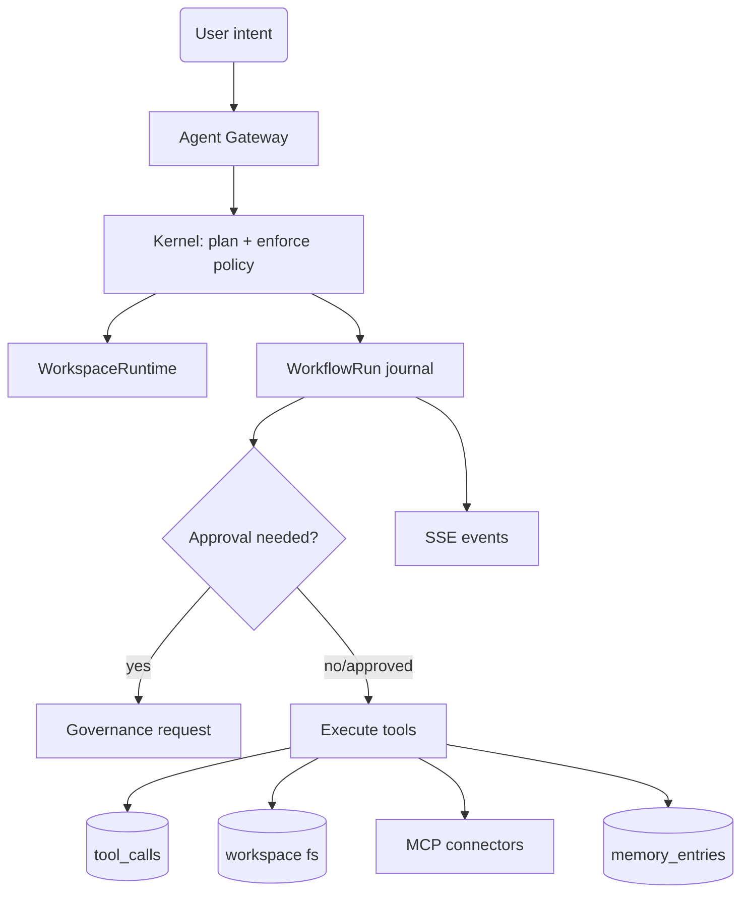

# AgentOS Computer Workspace — Design & Strategy (repo-native)

This document captures the AgentOS product/architecture strategy in a form that can be implemented in **Pixel-Agent** without rewriting the system from scratch.

## Executive summary (implementation-oriented)

AgentOS = **personal cloud workspace runtime** + **Agent Kernel**.

- The **workspace runtime** is the persistent compute/filesystem boundary (container/VM + disk + long-lived processes).
- The **Agent Kernel** receives intents, decomposes them into work, enforces governance/budget/policy, executes tools safely, and logs everything.

Pixel-Agent already has many kernel primitives (companies, governance requests, swarm lifecycle, tool call tracing, SSE). The main missing pieces are the “personal cloud computer” substrate: workspace runtime + tool sandbox + snapshots + MCP connection registry.

## Product vision & positioning (tightened)

**Positioning**: “Your personal AI cloud computer with enterprise-grade governance.”

Where AgentOS differs from generic assistants:

- **Persistence**: a durable workspace filesystem + runtime where agents can operate continuously.
- **Orchestration**: multi-agent plans (planner/operator/verifier) with parallel execution and lifecycle management.
- **Governance**: approvals + scoped capabilities + budgets + audit trails + rollback by default.

## System architecture (Pixel-Agent mapping)

See `architecture.md` for the full mapping, but the key layer boundaries are:

- **Control plane**: `companies` + auth/billing + policy templates.
- **Kernel services**: `SwarmEngine`, `HeartbeatRunner`, `GovernanceService` (today).
- **New layer**: `WorkspaceRuntime` (container/dir + sandbox tool runner + optional services).
- **Tool plane**: Tool registry + sandbox execution + MCP connectors; all invocations write `tool_calls`.
- **Memory**: `memory_entries` as the canonical journal; can later evolve into a graph/vector store.
- **Real-time UX**: SSE stream for run/phase/tool updates.

## Skills catalog (MVP-first)

Start with 4–5 skills that exercise the whole stack:

- **DailyBriefing**: read-only connectors + report write to workspace.
- **MeetingScheduler**: gated calendar write (approval) + audit.
- **DocSummarizer**: file read/write + memory write.
- **ResearchSynthesizer**: constrained web/MCP + injection-aware handling.
- **DeployMicroApp (gated)**: build/run inside workspace; opening public ports requires approval + snapshot.

Rationale: this set demonstrates persistence, connectors, sandboxing, approvals, auditability, and rollback.

## Governance & safety model (default-deny)

Agent autonomy is only useful if it is safe:

- **Scopes/capabilities**: enforce at tool invocation boundaries.
- **Approval gates**: any irreversible or external side-effect (send email, publish, delete/move files, open ports).
- **Budgets**: token/cost limits per run and per time window; alert + circuit-breaker.
- **Snapshots**: create restore points before high-risk operations; allow explicit restore via approval.
- **Egress controls**: default-deny network in tool sandboxes; allowlist per tool/skill.

## Deployment options (sequenced)

1. **MVP**: local-dir workspace runtime + process sandboxing (dev-first).
2. **SaaS**: container-backed workspaces with persistent volumes.
3. **Hard isolation tier**: microVM/VM-backed workspaces (optional later).

## Roadmap (repo-feasible)

Short roadmap expressed as concrete deliverables:

- **Phase A — Workspace substrate**
  - `workspaces` table + runtime root management
  - sandbox runner meeting `VAL-TOOL-*` contracts
  - snapshot create/list/restore

- **Phase B — MCP connector plane**
  - `mcp_connections` table + connector health checks
  - at least one connector end-to-end (read + write, gated)

- **Phase C — Durable-ish workflows**
  - `workflow_runs` + `workflow_steps` journaling
  - pause/resume when `governance_requests` are pending

- **Phase D — Skill library + UX**
  - ship 4–5 starter skills
  - SSE-driven UI updates and “Clipboard” aggregated run view

## Diagrams

