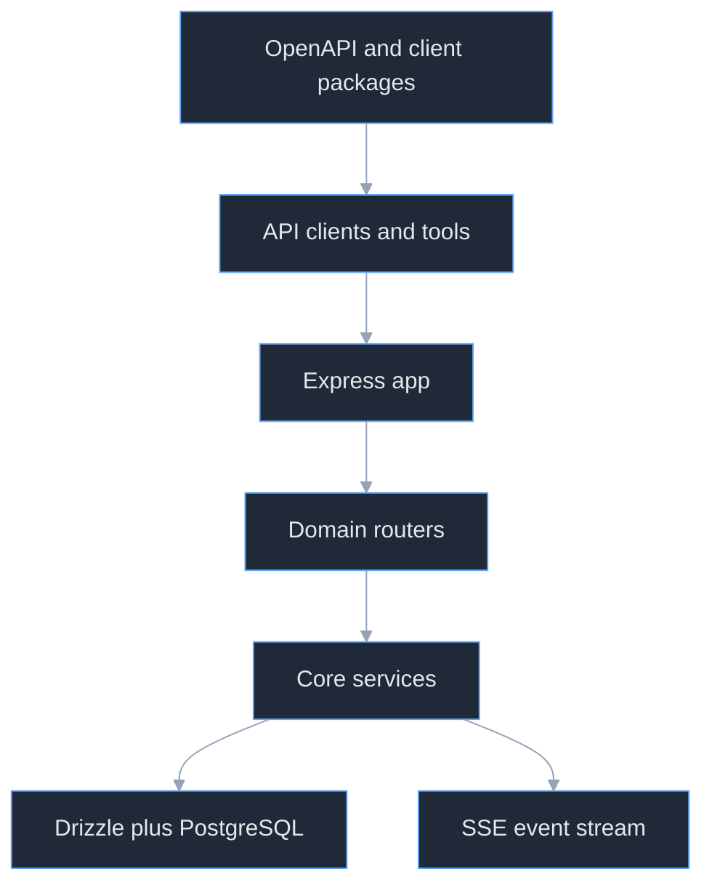
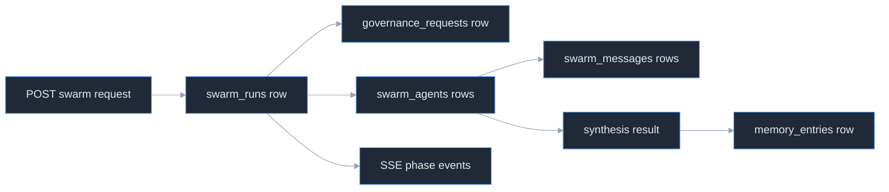
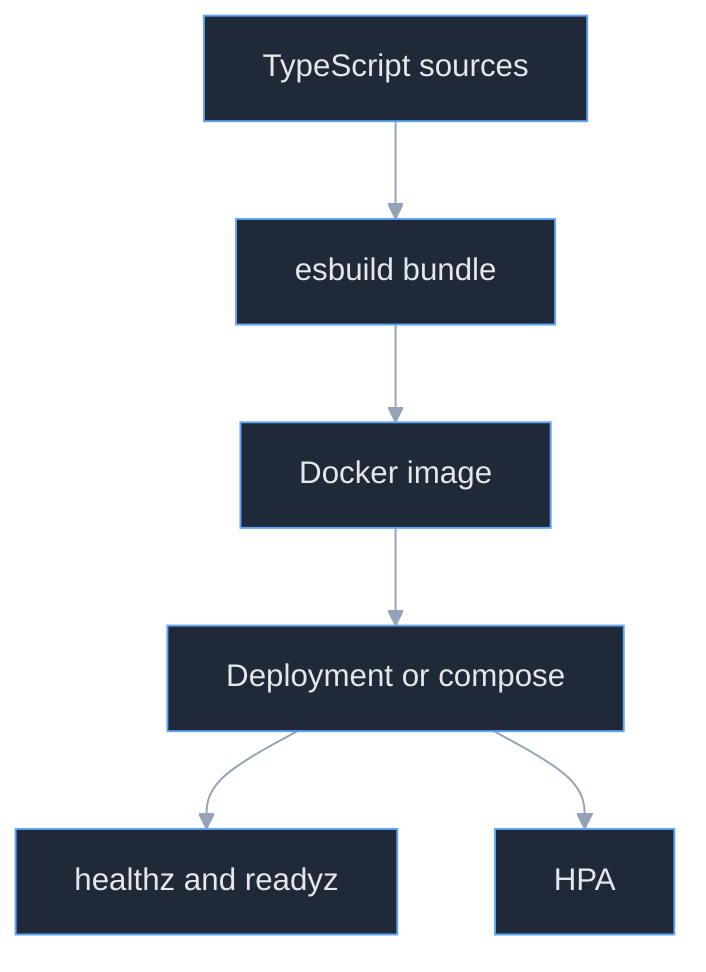

# Principal Onboarding: Pixel-Agent

## 1. System philosophy and design principles

Pixel-Agent is organized as a multi-tenant control plane for autonomous agents. The repo-level guidance defines the product as a pnpm monorepo for "autonomous agent swarms" with governance, budgeting, task orchestration, and observability, and the database model makes `companies` the top-level tenant boundary that owns budget and circuit-breaker state. (CLAUDE.md:5-8) (lib/db/src/schema/companies.ts:5-16)

The design favors asynchronous orchestration over long synchronous requests. The route layer returns `202` for swarm phase changes and background execution, while the `SwarmEngine` explicitly drives the lifecycle in `runSwarm()` and emits phase changes through SSE. (artifacts/api-server/src/routes/swarms.ts:32-60) (artifacts/api-server/src/routes/swarms.ts:113-181) (artifacts/api-server/src/services/swarmEngine.ts:137-155)

The system also chooses explicit operational guardrails over optimistic "best effort" execution. Heartbeats stop when a company circuit is open or budgets are exhausted, task claiming uses version checks for optimistic locking, and delegation is restricted to direct reports with bounded depth. (artifacts/api-server/src/services/heartbeatRunner.ts:60-91) (artifacts/api-server/src/routes/tasks.ts:77-125) (artifacts/api-server/src/services/hierarchyService.ts:55-112)

## 2. Architecture overview

The primary runtime is an Express 5 API server. `app.ts` wires middleware, mounts all domain routers at `/api`, and starts the heartbeat scheduler on boot; `index.ts` is a thin process entrypoint that validates `PORT` and starts listening. (artifacts/api-server/src/app.ts:1-21) (artifacts/api-server/src/index.ts:1-19)

The monorepo splits responsibilities across shared libraries. `@workspace/db` owns the Drizzle/PostgreSQL schema and runtime connection, `@workspace/api-zod` hosts shared Zod models, `@workspace/api-spec` owns the OpenAPI description, and `@workspace/api-client-react` provides a fetch layer that turns HTTP failures into typed `ApiError` instances. (CLAUDE.md:97-101) (lib/db/src/index.ts:1-16) (lib/api-spec/openapi.yaml:1-37) (lib/api-client-react/src/custom-fetch.ts:1-149)

This diagram is derived from `app.ts`, the route aggregator, the shared DB package, the SSE route, and the OpenAPI package layout. (artifacts/api-server/src/app.ts:1-21) (artifacts/api-server/src/routes/index.ts:1-34) (artifacts/api-server/src/routes/events.ts:1-54) (lib/db/src/index.ts:1-16) (lib/api-spec/openapi.yaml:1-37)

## 3. Key abstractions and interfaces

`SwarmEngine` is the main orchestration abstraction. It models a six-phase lifecycle with explicit methods for propose, approve, spawn, execute, synthesize, dissolve, and fail, and it is responsible for both persistence and phase-change broadcasting. (artifacts/api-server/src/services/swarmEngine.ts:48-155) (artifacts/api-server/src/services/swarmEngine.ts:157-398)

`HeartbeatRunner` is the scheduled execution abstraction. It loads due agents, records run state, executes agents with bounded concurrency and timeouts, and writes failures into a dead-letter queue. (artifacts/api-server/src/services/heartbeatRunner.ts:36-198) (artifacts/api-server/src/services/heartbeatRunner.ts:200-407)

`CapabilityTokenService` and `HierarchyService` together define the authorization model. Tokens are single-active-per-agent, scope-based, and delegation-aware; hierarchy validation enforces direct-report-only delegation and manager-only escalation. (artifacts/api-server/src/services/capabilityTokenService.ts:29-106) (artifacts/api-server/src/services/capabilityTokenService.ts:112-240) (artifacts/api-server/src/services/hierarchyService.ts:55-134)

`AgentPool` and `CircuitBreaker` are the load-bearing resilience primitives. The pool limits concurrency without hiding programming errors, and the circuit breaker tracks failure counts with `closed`, `open`, and `half-open` states. (artifacts/api-server/src/services/agentPool.ts:1-45) (artifacts/api-server/src/services/circuitBreaker.ts:1-64)

## 4. Decision log

**Decision: keep schema and request validation close together.** The DB package exports Drizzle tables plus `createInsertSchema()`-based insert models, and route handlers consume those insert schemas directly before writing to the database. That reduces drift between persistence and request validation. (lib/db/src/schema/companies.ts:1-20) (lib/db/src/schema/agent-tasks.ts:1-26) (artifacts/api-server/src/routes/companies.ts:17-27) (artifacts/api-server/src/routes/tasks.ts:35-47)

**Decision: run long operations in the background.** Swarm creation returns `202` and kicks off `runSwarm()` asynchronously when approval is not needed, and approval endpoints do the same after governance approval. This avoids turning orchestration into a blocking HTTP request. (artifacts/api-server/src/routes/swarms.ts:39-60) (artifacts/api-server/src/routes/swarms.ts:113-141)

**Decision: use SSE, not a broker-backed event system, for live updates.** The event subsystem is an in-memory subscriber map keyed by `companyId`, with manual heartbeat pings every 30 seconds. That keeps the implementation simple but also ties live event delivery to process memory. (artifacts/api-server/src/routes/events.ts:3-17) (artifacts/api-server/src/routes/events.ts:21-52)

**Decision: use optimistic locking for task claiming.** Claims compare the caller's `version` against the stored row and include the version in the `WHERE` clause for the update. That avoids central locks while still rejecting races. (artifacts/api-server/src/routes/tasks.ts:77-125)

## 5. Dependency rationale

Express is the core web framework because the app is structured as middleware plus route modules and exposes plain HTTP and SSE endpoints directly, without an additional framework layer. (artifacts/api-server/src/app.ts:1-21) (artifacts/api-server/src/routes/events.ts:21-52) (artifacts/api-server/package.json:11-20)

Drizzle ORM plus PostgreSQL were chosen for typed relational modeling. The repo exports table definitions from a single schema package, constructs Zod insert schemas from those tables, and requires `DATABASE_URL` at runtime. (lib/db/src/index.ts:1-16) (lib/db/src/schema/index.ts:1-15) (lib/db/src/schema/companies.ts:5-20) (lib/db/src/schema/agents.ts:6-36)

esbuild is the production bundler for the API server because the custom build script explicitly bundles the server, allowlists selected dependencies for cold-start reasons, and writes a single minified CJS entrypoint. (artifacts/api-server/build.ts:9-69)

OpenAPI, Zod, and the React client package form a contract layer. The API spec describes the REST surface, the DB package generates Zod insert schemas, and the client fetch layer turns transport errors into structured exceptions. (lib/api-spec/openapi.yaml:1-37) (lib/db/src/schema/companies.ts:18-20) (lib/api-client-react/src/custom-fetch.ts:100-149)

## 6. Data flow and state

Swarm data starts in the `/companies/:companyId/swarms` route, which validates required request fields, calls `proposeSwarm()`, and conditionally kicks off `runSwarm()` in the background. The engine creates a `swarm_runs` record, optionally creates a governance request, spawns `swarm_agents`, updates phase state, synthesizes outputs, archives the synthesis into `memory_entries`, and emits SSE notifications at each phase transition. (artifacts/api-server/src/routes/swarms.ts:39-60) (artifacts/api-server/src/services/swarmEngine.ts:53-111) (artifacts/api-server/src/services/swarmEngine.ts:159-198) (artifacts/api-server/src/services/swarmEngine.ts:203-350)

Heartbeat data flows through a similar pipeline but is scheduler-driven. `HeartbeatScheduler` polls active companies, calls `runHeartbeat()`, records a `heartbeat_runs` row plus per-agent run rows, executes due agents through `AgentPool`, updates spend and next-run timestamps, and writes unresolved failures into `heartbeat_dead_letters`. (artifacts/api-server/src/services/heartbeatScheduler.ts:52-81) (artifacts/api-server/src/services/heartbeatRunner.ts:56-198) (artifacts/api-server/src/services/heartbeatRunner.ts:279-407)

This flow is backed by the swarm route, engine methods, message bus usage, and memory-entry writes. (artifacts/api-server/src/routes/swarms.ts:39-60) (artifacts/api-server/src/services/swarmEngine.ts:94-106) (artifacts/api-server/src/services/swarmEngine.ts:177-188) (artifacts/api-server/src/services/swarmEngine.ts:256-267) (artifacts/api-server/src/services/swarmEngine.ts:321-337)

Tasks have their own state model. The `agent_tasks` table stores `status`, `claimedBy`, and `version`, and the routes expose list, create, update, and claim operations with conflict handling. (lib/db/src/schema/agent-tasks.ts:8-22) (artifacts/api-server/src/routes/tasks.ts:8-125)

## 7. Failure modes and error handling

HTTP errors are normalized through `ApiError`, while unexpected exceptions fall through to a logged `500` response. That keeps route handlers simple and makes domain errors visible in transport responses. (artifacts/api-server/src/middlewares/error-handler.ts:3-29)

Heartbeat execution has several explicit failure modes: company circuit open, company budget exhausted, per-agent circuit open, per-agent budget exhausted, timeout, and repeated DLQ retries that end by marking the agent `circuit_open`. (artifacts/api-server/src/services/heartbeatRunner.ts:60-91) (artifacts/api-server/src/services/heartbeatRunner.ts:206-275) (artifacts/api-server/src/services/heartbeatRunner.ts:298-317)

Swarm execution handles failure more coarsely. `runSwarm()` catches any phase exception, increments failed metrics, and moves the swarm to `failed`, but individual swarm-agent execution currently swallows agent-level errors by marking the agent failed and continuing. (artifacts/api-server/src/services/swarmEngine.ts:141-155) (artifacts/api-server/src/services/swarmEngine.ts:248-278)

## 8. Performance characteristics

The main concurrency throttle is `AgentPool`, which defaults to ten concurrent workers and is reused by both swarm spawning/execution and heartbeat execution. That makes concurrency bounded but static by default. (artifacts/api-server/src/services/agentPool.ts:9-45) (artifacts/api-server/src/services/swarmEngine.ts:48-49) (artifacts/api-server/src/services/heartbeatRunner.ts:42-47)

The scheduler runs on a fixed 60-second interval, and the Kubernetes manifests assume horizontal scaling between two and eight replicas based on CPU and memory utilization. Those settings imply the current scaling model is timer-driven and pod-oriented rather than queue-driven. (artifacts/api-server/src/services/heartbeatScheduler.ts:18-31) (k8s/base/configmap.yml:10-17) (k8s/base/hpa.yml:9-28)

The build pipeline optimizes cold starts by bundling the API server with esbuild and only leaving selected dependencies external. That is a performance-oriented packaging choice, not just a convenience build step. (artifacts/api-server/build.ts:9-69)

## 9. Security model

The repo's security boundary is company scoping plus capability tokens. Most routes are nested under `/companies/:companyId/...`, token verification checks active unrevoked tokens in the database, and delegation is validated against the reporting hierarchy. (artifacts/api-server/src/routes/tasks.ts:8-29) (artifacts/api-server/src/services/capabilityTokenService.ts:112-143) (artifacts/api-server/src/services/hierarchyService.ts:80-112)

The token model is intentionally conservative. Minting revokes any existing live token for the same agent, snapshots token state back into `agents.capabilityToken` for quick reads, and scopes can only be delegated when the child agent is a direct report and the requested scopes are a subset of the parent's scopes. (artifacts/api-server/src/services/capabilityTokenService.ts:61-106) (artifacts/api-server/src/services/capabilityTokenService.ts:174-218) (artifacts/api-server/src/services/hierarchyService.ts:80-109)

One important trust-boundary weakness is the event stream. `/companies/:companyId/events` is a plain GET route backed by an in-memory subscriber registry, and there is no authentication or authorization check in the route itself. (artifacts/api-server/src/routes/events.ts:19-52)

## 10. Testing strategy

The repo does not currently define a test runner or lint script as a first-class workflow. The documented primary verification path is `tsc --noEmit`, and the workspace scripts expose `pnpm typecheck` and `pnpm build` as the main quality gates. (CLAUDE.md:23-41) (package.json:5-10) (artifacts/api-server/package.json:6-10)

That means the current quality strategy is static typing plus build verification, not automated behavioral tests. Operationally, this raises the importance of smoke-testing endpoints such as `/api/healthz`, `/api/readyz`, and `/api/metrics` after changes. (artifacts/api-server/src/routes/health.ts:7-23) (artifacts/api-server/src/routes/metrics.ts:6-14)

## 11. Operational concerns

Local development assumes PostgreSQL plus two required API variables: `DATABASE_URL` and `PORT`. The DB package throws if `DATABASE_URL` is missing, and the server entrypoint throws if `PORT` is missing or invalid. (lib/db/src/index.ts:7-14) (artifacts/api-server/src/index.ts:3-19)

The repo includes both development and production deployment paths. `docker-compose.yml` starts PostgreSQL and runs the API server in dev mode with hot reload, while `docker-compose.prod.yml` describes a production build with healthchecks and two replicas. Kubernetes manifests add probes, resource limits, and autoscaling. (docker-compose.yml:27-54) (docker-compose.prod.yml:29-63) (k8s/base/deployment.yml:24-60) (k8s/base/hpa.yml:9-28)

This deployment graph comes from the custom build script plus the compose and Kubernetes manifests. (artifacts/api-server/build.ts:40-69) (docker-compose.prod.yml:32-63) (k8s/base/deployment.yml:24-60) (k8s/base/hpa.yml:9-28)

## 12. Known technical debt

The most obvious debt is unfinished execution realism. `executeAgentHeartbeat()` is explicitly a stub, and swarm-agent execution in `SwarmEngine` is also a stub that fabricates output and fixed per-agent cost. (artifacts/api-server/src/services/agentExecutor.ts:1-17) (artifacts/api-server/src/services/swarmEngine.ts:248-255)

The repo also has documentation drift. `_docs/README.md` describes "DocBot" as an AI documentation platform with Python/FastAPI-style components, which does not match the actual Express/Drizzle/monorepo codebase described elsewhere in the repo. (artifacts/api-server/src/app.ts:1-21) (_docs/README.md:1-138)

Finally, several control-plane behaviors are still simplistic: governance expiration updates all pending requests without checking `expiresAt`, the scheduler interval is hard-coded in code, and the event stream is process-local state with no auth. (artifacts/api-server/src/services/governanceService.ts:208-229) (artifacts/api-server/src/services/heartbeatScheduler.ts:18-31) (artifacts/api-server/src/routes/events.ts:3-52)
